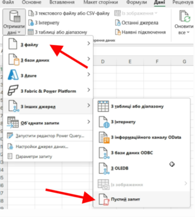
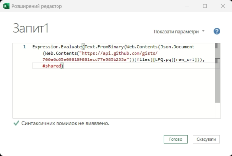
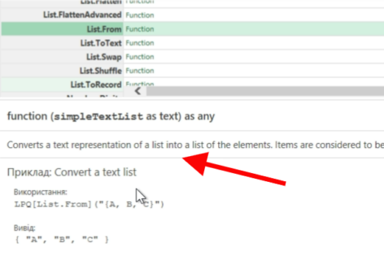
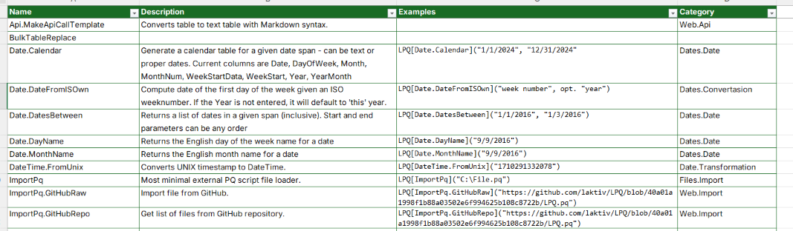

# LPQ Extension

Функції та Розширення для PowerQuery Excel. Собрана фласна бібліотека функцій. Назбирав та настрадав під час інтенсивної роботи над звітами. Нажаль, багато чого залишилось незавершеним, тому щоб розібратися, на жаль, може піти трохи більше часу, також нема загального листа функій. Але є що є, якщо Вам знадобиться - Welcome.
Всі функції працють. Дуже багато часу економило, хоча не завжди прям пишався оптимізацією, точніше її відсутністю, але там більше був бардах у файлах, окремо питань нема.

Спробувати дуже легко:

1. Додайте нове порожне з'єднання PowerQuery у Excel'і та додайте код
```powerquery
Expression.Evaluate(Text.FromBinary(Web.Contents(Json.Document(Web.Contents("https://api.github.com/gists/700a6d65e098189881ecd77e585b233a"))[files][LPQ.pq][raw_url])),#shared)
```

2. Перейменуйте підключення і все, можна використовувати. Формат написання такий: `LPQ[List.MyFunction](Param1, Param2)`, де LPQ - як ви назвете своє підключення. Де є опис - внизу буде текст.

  
 

Посилання на Gist: [https://api.github.com/gists/700a6d65e098189881ecd77e585b233a](https://gist.github.com/laktiv/700a6d65e098189881ecd77e585b233a)
Там 3 файла: бібліотека та два різних підключення (локальний файл та з gist). Версії файлів тут і там однакові.

Ще додав пустий файл де є бібліотека, котра розкладана у таблицю, щоб хоч список був перед очами. >:)

-->>> [LPQ.xlsx](https://github.com/laktiv/LPQ/blob/main/Assets/LPQ.xlsx)




## Посилання

- [ImkeF / M](https://github.com/ImkeF/M) ⭐
- [tirnovar / m-custom-functions](https://github.com/tirnovar/m-custom-functions)
- [tirnovar / Power_BI_REST_API_PQ](https://github.com/tirnovar/Power_BI_REST_API_PQ)
- [tirnovar / PowerBI-Icons](https://github.com/tirnovar/PowerBI-Icons)
- [dfinke / ImportExcel](https://github.com/dfinke/ImportExcel) ⭐
- [ninmonkey / ExcelAnt](https://github.com/ninmonkey/ExcelAnt)
- [ninmonkey / Ninmonkey.PowerQueryLib](https://github.com/ninmonkey/Ninmonkey.PowerQueryLib)
	- [ninmonkey / ninMonkQuery-examples](https://github.com/ninmonkey/ninMonkQuery-examples)
	- [ninmonkey / PowerQueryFunctions](https://github.com/ninmonkey/PowerQueryFunctions)
- [OscarValerock / PowerQueryFunctions](https://github.com/OscarValerock/PowerQueryFunctions)
- [getkks / Power-Query](https://github.com/getkks/Power-Query)
- [anton-dudarev / power-query](https://github.com/anton-dudarev/power-query)
- [Hugoberry / PowerQueryExtensions](https://github.com/Hugoberry/PowerQueryExtensions) ⭐
- [mogulargmbh / powerquerysnippets](https://github.com/mogulargmbh/powerquerysnippets)
- [IvanBond / PowerQueryModules](https://github.com/IvanBond/PowerQueryModules)
- [IvanBond / Power-Query-Excel-Formats](https://github.com/IvanBond/Power-Query-Excel-Formats)
- [IvanBond / Power-Refresh](https://github.com/IvanBond/Power-Refresh)